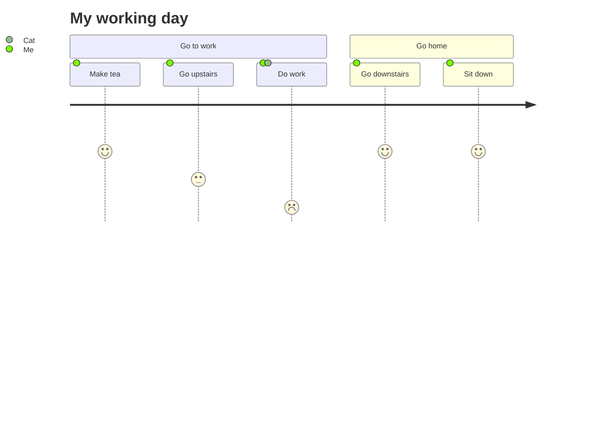
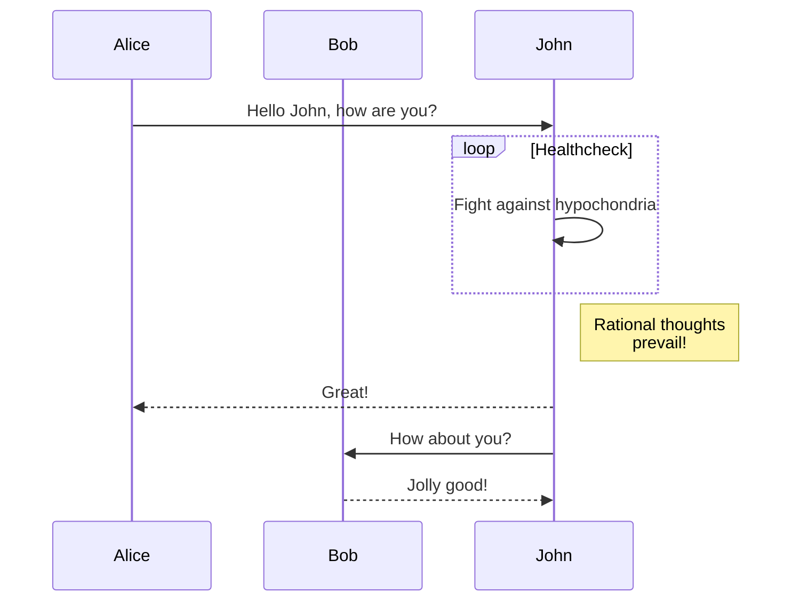

```sequence
Andrew->China: Says Hello
Note right of China: China thnks\nabout it
China-->Andrew: How are you?
Andrew->>China: I amd good thanks!
```

```sequence
Alice->Bob: Hello Bob, how are you?
Note right of Bob: Bob thinks
Bob-->Alice: I am good thanks!
```







